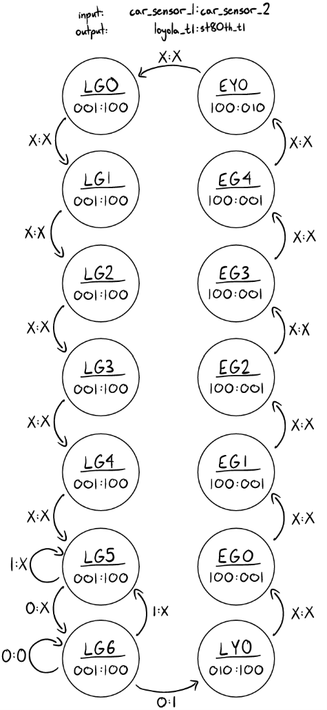
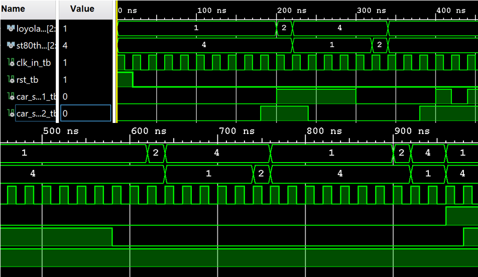

# FPGA Traffic Light Controller

This project implements a real-time traffic light control system on a ZedBoard FPGA using VHDL. The system models a two-way intersection using a finite state machine (FSM) with adaptive timing based on vehicle sensor inputs.

## Overview

The controller manages traffic flow between Loyola Boulevard and 80th Street, prioritizing the busier road while ensuring fair access. The system uses a 14-state FSM with precise timing derived from the FPGA clock.

## System Architecture

- Finite State Machine (Moore model)
- Clock division from 100 MHz → 0.5 Hz (2-second state intervals)
- Sensor-based adaptive timing
- FPGA implementation using VHDL

## FSM Design

The FSM consists of 14 states representing different traffic light configurations and timing conditions. State transitions depend on timing constraints and real-time sensor inputs.

## Simulation Results

Simulation in Vivado verified correct timing behavior, state transitions, and output responses. The waveform demonstrates:

- Proper clock-driven state transitions  
- Correct output encoding for traffic lights  
- Dynamic response to sensor inputs  

## Key Features

- 14-state FSM with one-hot encoding  
- Adaptive green light extension based on traffic detection  
- Deterministic timing using clock division  
- Hardware validation on FPGA  

## Files

- `docs/traffic-light-controller.pdf` — full design report and implementation details  

## Skills Demonstrated

- Digital system design (FSM)
- VHDL development
- FPGA implementation and debugging
- Clock management and timing design
- Hardware-software integration

## Why This Project Matters

This project demonstrates real-time control logic implemented directly in hardware. It highlights how FPGAs can be used for reliable, deterministic systems such as traffic control, where timing and responsiveness are critical.

## Author

Joshua Oliveira